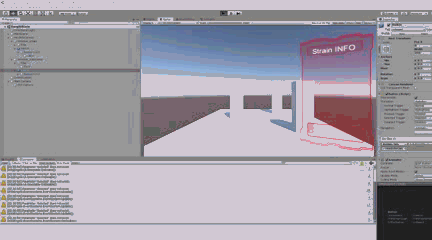
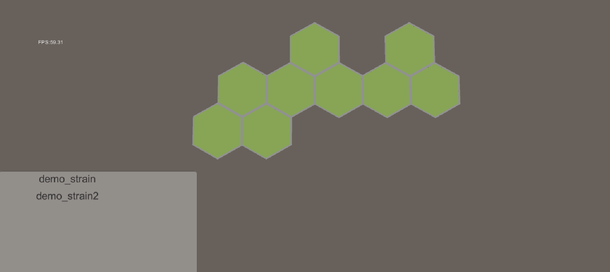
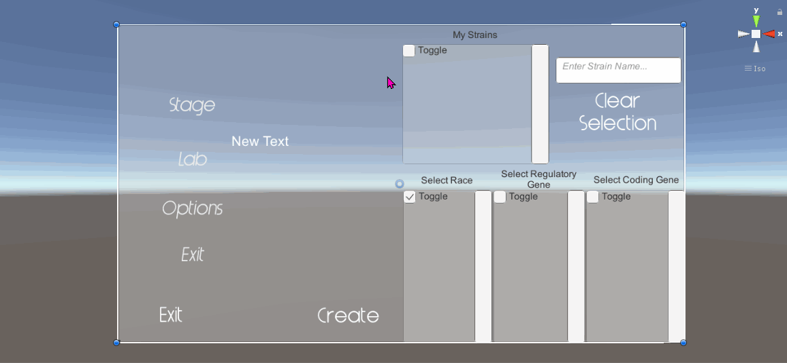

# CellWar.Game
Game for iGEM.
This game is used in HumanPractices part in our iGEM project. After iGEM, we can polish this game and make it for other uses. Meanwhile, this game is about the war of cells.

See [TODO List](<https://github.com/bennycui99/Cellwar.Game/blob/master/TODO.md>) and fuck your tasks off! LOL

## Where the hell we are?

### 9.10 In-Game Ready to use panel animation (in a separated project)



Once the gameplay itself is fixed, we can begin to refine its looking.

### 9.8 MapEditor
When holding a bacteria/ chemical you can not active/de-active a block.

Left Click to active/ right click to de-active.

Left Click multiple times can change the capacity of a block.

Left Click to add to block(can add multiple tiems)/Right Click to discard the holding.

Z to discard last bacteria/ X to discard last chemical.

Bacteria reads from Resources/Save/strain.json; Chemicals reads from Resources/GameData/chemicals.json.

Export to Resources/Save/map_generation.json

GameScene reads map from Resources/GameData/map.json

### 9.6 Implement Video Manager - Fade between scenes

The in-game fade in animation remain unimplemented, but the API is easy to use.


### 9.4 Smooth Game Animations




### 7.30 Finished Lab



## About CellWar Json Files In GameData

We use excel to edit raw data and for 2json, you can use [THIS SITE](<http://www.bejson.com/json/col2json/>)

to convert the excel to json file.

see **CellWar.Document/game_data.xlsx** file to make sense about the core game data of CW.


## Directories

The repository contains following folders in root directory.

* **CellWar.Game** - Unity3d project.

  

## FAQs

### Haste cloning & pulling

For the fucking previous commits were not using gitignore file, it might takes you a fucking shit long time to clone the whole repository. So you can clone like this.

#### Clone

~~~shell
$ git clone --depth=1 https://github.com/bennycui99/iGEM-game.git
~~~

Or you want pull the latest change.

#### Pull

```shell
$ git pull --depth=1
```

Or a lazier way.

```shell
$ . pull.sh
```


### Haste Unity Starting Up

You should install [ppbash](<http://github.com/cyf-gh/ppbash>) first enable to use the [go] command.

```shell
$ . open_scene.sh
```

For powershell,

```powershell
PS >. open_scene.ps1
```
