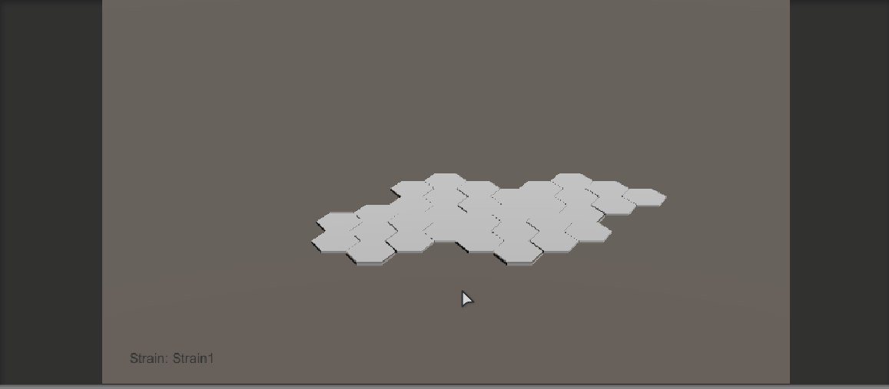

# CellWar.Game
Game for iGEM.
This game is used in HumanPractices part in our iGEM project. After iGEM, we can polish this game and make it for other uses. Meanwhile, this game is about the war of cells.

See [TODO List](<https://github.com/bennycui99/Cellwar.Game/blob/master/TODO.md>) and fuck your tasks off! LOL

## Where the hell we are?
### 7.17



## C# Coding/Scripting Agreement

### Namespace

All game c# logic should be wrote in namespace like

```c#
namespace CellWar {
    namspace Foo {
        ...
    }
}
```

or

```c#
namespace CellWar.Foo {
    
}
```


### Class Members

```
m[MemberName]

eg.
Block mHexBlock;
```

### Property

```
[Capital]xxxx

eg.
int Length { get; set; }
```

### Class Name & Namespace Name

```
both [Capital]xxxx

eg.
namespace CellWar.Model.Foo {
    public class FooClass {
        ...
    }
}
```


### MVC

The project obeys the **MVC** pattern, whose **Model** refers to the CellWar.Model namespace. **View** refers to all the unity scripts attached to the unity game object.

#### Model

which refers to the [model.cs](<https://github.com/bennycui99/Cellwar.Game/blob/master/CellWar.Game/Assets/Scripts/Model.cs>) file for the time being.

#### View

which refers to all the unity scripts attached to the unity game object.

All unity script, which is attached to the game object, should be named as

```
U3D_[ScriptName].cs

eg
U3D_CameraLogic.cs
```

#### Controller

be left vacant for the time being.


## Directories

The repository contains following folders in root directory.

* **CellWar.Game** - Unity3d project.
* **CellWar.Document** - Literal documents about the designing of the game.


## FAQs

### Haste cloning & pulling

For the fucking previous commits were not using gitignore file, it might takes you a fucking shit long time to clone the whole repository. So you can clone like this.

#### Clone

~~~shell
$ git clone --depth=1 https://github.com/bennycui99/iGEM-game.git
~~~

Or you want pull the latest change.

#### Pull

```shell
$ git pull --depth=1
```

Or a lazier way.

```shell
$ . pull.sh
```


### Haste Unity Starting Up

You should install [ppbash](<http://github.com/cyf-gh/ppbash>) first enable to use the [go] command.

```shell
$ . open_scene.sh
```

